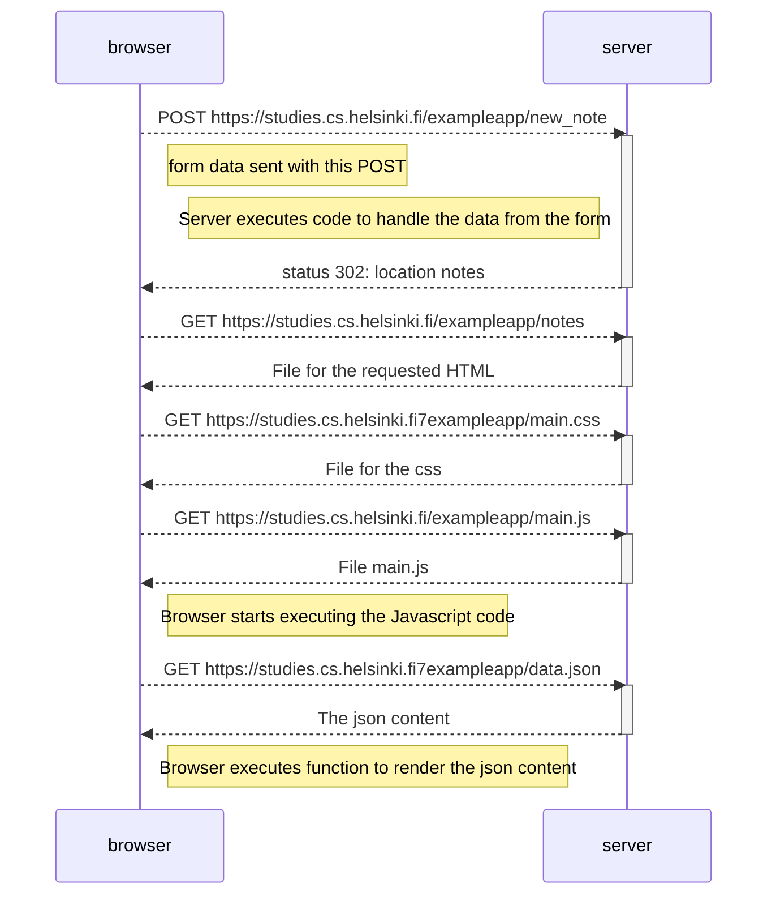

```mermaid
    sequenceDiagram
        participant browser
        participant server

        browser-->>server: POST https://studies.cs.helsinki.fi/exampleapp/new_note
        activate server
        Note right of browser: form data sent with this POST
        Note left of server: Server executes code to handle the data from the form
        server-->>browser: status 302: location notes
        deactivate server

        browser-->>server: GET https://studies.cs.helsinki.fi/exampleapp/notes
        activate server
        server-->>browser: File for the requested HTML
        deactivate server

        browser-->>server: GET https://studies.cs.helsinki.fi7exampleapp/main.css
        activate server
        server-->>browser: File for the css
        deactivate server

        browser-->>server: GET https://studies.cs.helsinki.fi/exampleapp/main.js
        activate server
        server-->>browser: File main.js
        deactivate server

        Note right of browser: Browser starts executing the Javascript code

        browser-->>server: GET https://studies.cs.helsinki.fi7exampleapp/data.json
        activate server
        server-->>browser: The json content
        deactivate server

        Note right of browser: Browser executes function to render the json content
```
