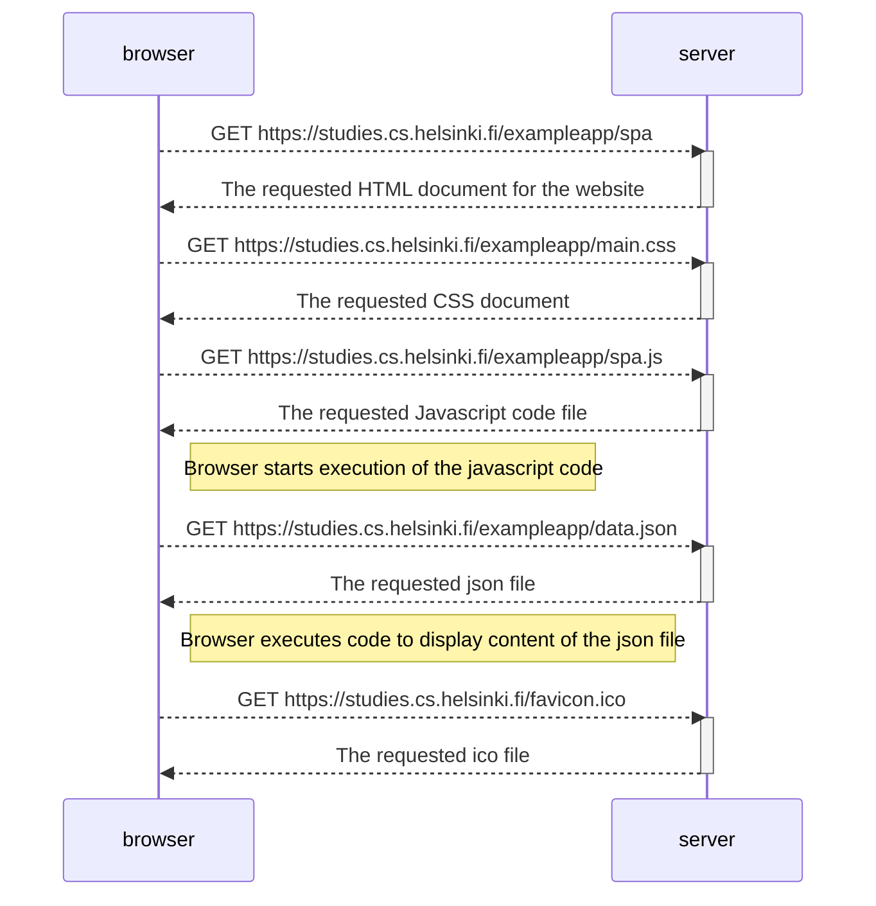

```mermaid
  sequenceDiagram
    participant browser
    participant server
    
    browser-->>server: GET https://studies.cs.helsinki.fi/exampleapp/spa
    activate server
    server-->>browser: The requested HTML document for the website
    deactivate server
    
    browser-->>server: GET https://studies.cs.helsinki.fi/exampleapp/main.css
    activate server
    server-->>browser: The requested CSS document
    deactivate server
    
    browser-->>server: GET https://studies.cs.helsinki.fi/exampleapp/spa.js
    activate server
    server-->>browser: The requested Javascript code file
    deactivate server
    
    Note right of browser: Browser starts execution of the javascript code
    
    browser-->>server: GET https://studies.cs.helsinki.fi/exampleapp/data.json
    activate server
    server-->>browser: The requested json file
    deactivate server
    
    Note right of browser: Browser executes code to display content of the json file
    
    browser-->>server: GET https://studies.cs.helsinki.fi/favicon.ico
    activate server
    server-->>browser: The requested ico file
    deactivate server
```
